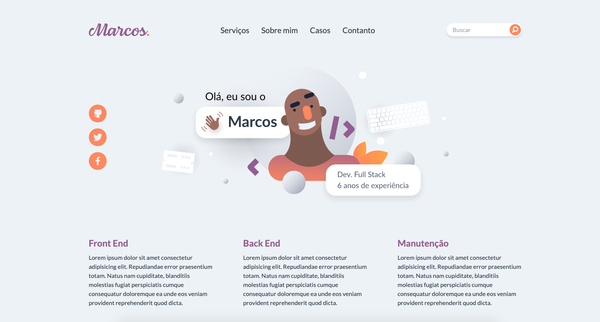

# Marcos
Portfólio construído com Vuejs utilizando a metodologia do Atomic Design.



<br />
<br />

# 👨🏻‍💻 Stack
📍 Vue  
📍 Sass  
📍 Typescript  

<br />

# 👯‍♀️ Clone
Faça o clone do repositório

```shell
git clone https://github.com/duc-k/atomic-design.git 
```

<br />

# 📦 Dependências
Instale as dependências necessárias

```shell
yarn install
```

<br />

# 🚀 Execução
Execute o servidor

```shell
yarn serve
```

<br />

# 🔗 URL
Abra à URL no navegador

```shell
http://localhost:8080/
```